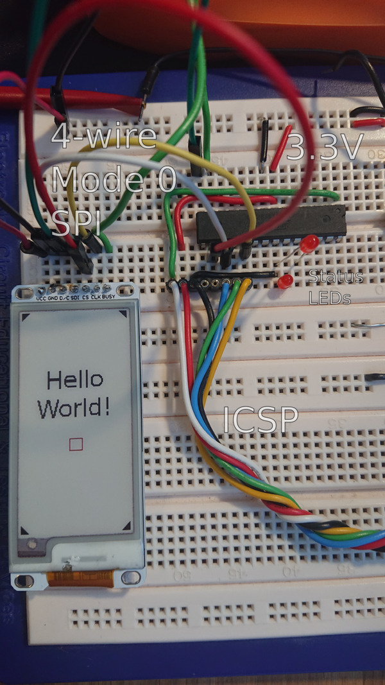

# Heltec 2.13" E-Ink Display on an `atmega328`

A personal experiment to try and get this display working. I think it
was successful but one of my displays sometimes don't want to
update. I don't know why. Could be this code, so beware! There comes
no warranty with this software.

Everything is hardcoded, pin configuration and target chip. But there
are no dependencies (except avr-gcc).

I'm still putting it out here in case someone could get something out
of it.

The MCU in the picture is a Atmel ATMEGA328P and the EInk display says
WFT0213CZ16 LW on the back. I think that would be the HTEW0213Z16 on
[this official page](https://docs.heltec.cn/#/en/products/display/eink/heltec_eink_display_list) 
and I think it's also the product enlisted [here](https://heltec.org/project/213-e-ink/).

If you run this code unmodified, it should display the contents of
[`hello.png`](hello.png) on the screen as shown in picture above.

## References and sources

I've used [the official data sheet](https://resource.heltec.cn/download/e-ink/213/2.13b%26w%26r/HTEW0213Z16_V13/HTEW0213Z16_V13.pdf). When that one was unclear, I looked at the 
[stm32 example code](https://resource.heltec.cn/download/e-ink/213/2.13b%26w%26r/HTEW0213Z16_V13/E-INK-213-BWR.zip) for some inspiration. This took me 1 day. Things like this
should really not be that hard!

It was surprisingly hard to find a working startup sequence. I couldn't get the
[official](https://github.com/HelTecAutomation/e-ink/) AVR HelTec code to work.

start   23:25:45
etter   13:00:00 
klokken 13:30:00
faktisk tid  9.9t
målt tid    13.0t 
dvs: WDT går i 113% hastiget av normal klokketid
